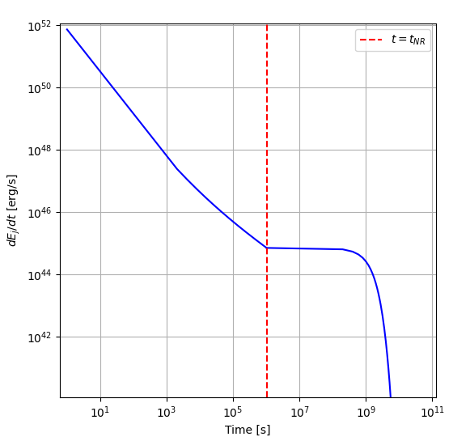

## Basic Usage

1. First, clone the GitHub repository into your editor with the following command:

```bash
git clone https://github.com/Om-Kasar/GRB-Jet-Energy-Model.git
```

2. After doing so, navigate to the **config** folder in the directory. Add the basic parameters of the observed GRB into the .yaml file for the numerical simluation.

```yaml
# Parameters.yaml:

t_dec: 
densityProportionalityConstant: 
powerLawIndex: 
radiusProportionalityConstant: 
surroundingMediumDensity: 
initialEnergyEmitted: 
```

3. Afterwards, go to the "parameters.py" file. Change the paths to the "Parameters.yaml" file according to your machine. Run the script and input the initial ejection angle of the observed GRB in radians into the terminal.

```
Give the initial ejection angle of the GRB, in radians: (eg. 0.7)

Calculations complete. Results saved to CalculatedParameters.yaml.
```

The program will then make a dynamically created "CalculatedParameters.yaml" file which estimates other variables of the GRB needed for the numerical simulation.

4. Navigate to the "GRB-JET-ENERGY-MODEL.py" file and change the "burstConfigs" path for both .yaml files according to your machine. Use the C++ system's "jef.load_burst_configs()" function in order to fetch each of the parameters into the program.

```python
import jet_energy_functions as jef

burstConfigs = jef.load_burst_configs(
    parameters_path="C:/repos/GRB-Jet-Energy-Model/config/Parameters.yaml", # Change this to the path to the "Parameters.yaml" file located in this directory.
    calculated_parameters_path="C:/repos/GRB-Jet-Energy-Model/config/CalculatedParameters.yaml" # Change this to the path to the "CalculatedParameters.yaml" file located in this directory.
)
```

5. Finally, run the program to get an approximated graph of the numerical simulation. This should yield an image looking like this:


**NOTE:** Always make sure to edit each files' paths according to your environment in order to make the simulation work.
